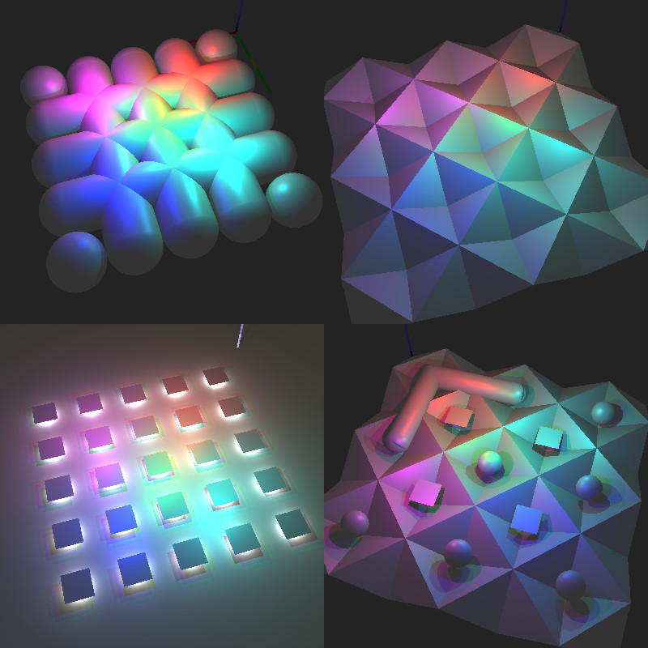

# Ray-tracer-mac

## Description (from the subject)

> The goal of your program is to generate images using Raytracing protocol. Those computer generated images will each represent a scene, as seen from a specific angle and position, defined by simple geometric objects, and each with its own lighting system.

### Examples


### Raytracing protocol in one picture:  


## Implementation detailes
### Allowed functions
* open
* close
* read
* write
* malloc
* free
* perror
* strerror
* exit
* math library (math.h)
* [mlx](https://harm-smits.github.io/42docs/libs/minilibx/introduction.html) (simple window creation library)


### Fugures
```
plane, sphere, cylinder, square, and triangle
```

### Showing of result
By the subject I had to implement two way of presenting result of render:
* show result in interactive window using mlx library (small library create for 42 needs);
* saving image as bmp file (no library was allowed to create bmp file).

Config file
```
Your program must take as a first argument a scene description file with the .rt
extension.
◦ It will contain the window/rendered image size, which implies your miniRT must be able to render in any positive size.
◦ Each type of element can be separated by one or more empty line(s).
◦ Each type of information from an element can be separated by one or more
space(s).
◦ Each type of element can be set in any order in the file.
◦ Elements which are defined by a capital letter can only be declared once in the scene.
```
Example of config file:
```
c   -50,0,30          1,0.5,0	100
l   -40,0,30		        0.7	                  255,255,255

pl	0,0,0		  0,1.0,0				  255,0,225
sp	0,0,20				20		          255,0,0
sq	0,100,40	  0,0,1.0	30		          42,42,0
cy	50.0,0.0,20.6	  0,0,1.0       14.2	    21.42	  10,0,255
tr	10,20,10	  10,10,20	20,10,10		  0,0,255
```
Note: Description of config file you can find in `en.subject.pdf`

## Project structure
* **srcs**
  * **scene_[any].c** - functions for scene representation, objects, light, cameras
  * **object_[any].c** - functions for working with
  * **get_scene_from_file_[any].c** - parsing config file
  * **validation_[any].c** - functions to validate config file
  * **image_[any].c** - functions for image representation (mlx object, array for storring every pixel information)
  * **render_[any].c** - implementation of Raytracing protocol
  * **mlx_[any].c** - helper functions to work with mlx library
* **includes** - headerfiles
* **libft** - self-written: C standard library and linked list library
* **scenes** - example scenes for testing

## How to build
requirements: macos (for mlx library), gcc, make, xcode (for mlx library)

To build the project run `make` command in the root of project (near Makefile)

## How to use
```
./miniRT scene.rt --save
```
1. file with .rt extension containing scene description.
2. "--save" key implements saving of the rendered scene to file with .bmp extension ("--save" is an optional argument).


